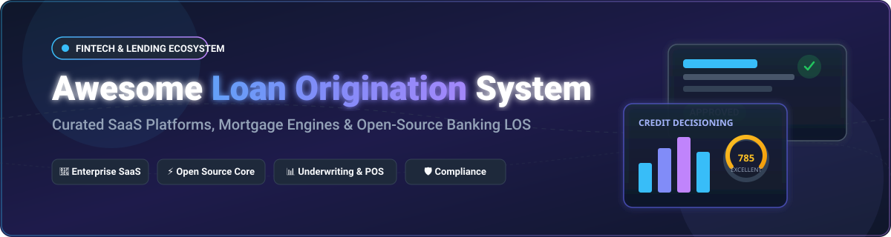

# 🏦 Awesome Loan Origination System (LOS)

  

  
  
  
  
  
  
  
  

---

## 📌 Overview & SEO Summary

A curated directory of top **Loan Origination System (LOS) Platforms**, **Mortgage POS Technologies**, **Digital Lending SaaS**, and **Open-Source Core Banking Engines**. 

Loan Origination Systems manage the end-to-end lifecycle of financial credit products—from initial borrower application intake, point-of-sale (POS) data capture, credit scoring, underwriting workflows, document management, compliance checks, and closing disclosures, to final funding and secondary market handoff.

Whether you are building a modern digital lender, evaluating commercial banking platforms, or deploying open-source microfinance tools, this guide provides a structured breakdown of industry leaders and open solutions.

---

## 📑 Table of Contents

- [📊 Industry Market Size & Sector Structure](#-industry-market-size--sector-structure)
- [🏢 Enterprise SaaS & Hosted Platforms](#-enterprise-saas--hosted-platforms)
- [⚡ Open-Source GitHub Repositories](#-open-source-github-repositories)
- [🎯 Key Evaluation Criteria for LOS Selection](#-key-evaluation-criteria-for-los-selection)
- [🤝 How to Contribute](#-how-to-contribute)
- [⚖️ Disclaimer](#️-disclaimer)
- [💖 Support & Sponsorship](#-support--sponsorship)
- [📈 Star History](#-star-history)

---

## 📊 Industry Market Size & Sector Structure

> [!NOTE]
> **Market Size & Fragmentation:** The global **Loan Origination System (LOS) software market** is estimated at **$5.8 Billion to $6.2 Billion**, projected to reach **$12.5+ Billion** by 2030 (growing at a CAGR of ~11.5%). The sector is **moderately to highly fragmented**, split across specialized verticals: U.S. residential mortgage origination (dominated by ICE Encompass and Blend), commercial/small business banking (led by nCino), credit union multi-product lending (MeridianLink), and alternative digital finance engines.

---

## 🏢 Enterprise SaaS & Hosted Platforms

Below is a detailed comparison of leading commercial SaaS Loan Origination Systems, sorted by **Company Valuation / Market Cap (Descending)**.

| 🏢 Product | 💰 Valuation / Company Size | 🏷️ Starting Price | 🎁 Free Tier / Trial Limit | 🚀 Primary Focus & Key Capabilities |
| :--- | :--- | :--- | :--- | :--- |
| **[ICE Encompass](https://www.icemortgagetechnology.com/)** | **~$85 Billion** (Parent ICE Market Cap) / **~$1.4B** Segment Revenue | Starting at **$2,000 / month** (plus $25–$100 per closed loan volume fee) | **0 Days Free Trial** *(Custom enterprise demo & sandbox environment upon request)* | Enterprise U.S. residential mortgage origination, secondary marketing, automated compliance checks & closing. |
| **[nCino](https://www.ncino.com/)** | **~$2.4 Billion** Market Cap / **$594.8 Million** FY2026 Revenue | Starting at **$175 / user / month** (min. $10,000 / year contract) | **0 Days Free Trial** *(Guided institutional demonstration available upon request)* | Salesforce-native cloud banking platform covering commercial, small business, and mortgage origination. |
| **[MeridianLink](https://www.meridianlink.com/)** | **~$1.47 Billion** Market Cap / **$326 Million** Annual Revenue | Starting at **~$1,500 / month** (~$17,000 / year base fee) | **0 Days Free Trial** *(Institutional evaluation environment upon request)* | Multi-product LOS for credit unions and community banks covering consumer loans, auto finance, and mortgage. |
| **[Blend Labs](https://blend.com/)** | **~$460 Million** EV / **$140 Million** Annual Revenue | Starting at **$1,000 / month** (or $50–$150 per funded loan base) | **0 Days Free Trial** *(Enterprise pilot preview & demo available upon request)* | Digital lending point-of-sale (POS) and AI-driven automated borrower intake for mortgage & consumer banking. |
| **[Mortgage Cadence](https://www.mortgagecadence.com/)** | **~$150 Million** Est. Valuation / **~$50 Million** Revenue | Starting at **~$1,200 / month** (plus custom volume per-closed loan fee) | **0 Days Free Trial** *(Direct sales consultation and demo upon request)* | Comprehensive end-to-end mortgage origination, pricing engine, and secondary market execution platform. |
| **[TurnKey Lender](https://www.turnkey-lender.com/)** | **~$50 Million** Est. Valuation / **~$22 Million** Revenue ($18.1M Funding) | Starting at **$500 / month** (up to $2,500/mo based on portfolio size) | **14-Day Free Trial** *(Available for qualified digital lenders; sandbox upon request)* | AI-powered decisioning, credit scoring, loan origination, and automated servicing for alternative lenders. |
| **[BytePro](https://www.bytepro.com/)** | **~$40 Million** Est. Valuation / **~$20 Million** Revenue | Starting at **$250 / user / month** | **0 Days Free Trial** *(Guided video walkthrough and demo upon request)* | Highly customizable desktop & cloud mortgage origination software tailored for brokers & independent lenders. |

---

## ⚡ Open-Source GitHub Repositories

Below are notable open-source core banking engines, loan management systems, and origination modules, sorted by **GitHub Stars_Count (Descending)**.

| 📦 Repository Name | ⭐ GitHub Stars_Count | 📜 Description & Core Capabilities |
| :--- | :--- | :--- |
| **[Apache Fineract](https://github.com/apache/fineract)** |  | Enterprise open-source core banking engine with robust loan origination, credit scoring, portfolio management, multi-currency support, and accounting. |
| **[Open Bank Project API](https://github.com/OpenBankProject/OBP-API)** |  | Open RESTful API platform for banks providing Open Banking, PSD2/XS2A compliance, customer intake, and lending integration endpoints. |
| **[Mifos X Web App](https://github.com/openMF/web-app)** |  | Official Angular single-page web client for Mifos X & Apache Fineract, featuring loan application intake, KYC verification, and officer workflows. |
| **[Mifos Mobile](https://github.com/openMF/mifos-mobile)** |  | Native Android client app enabling borrower self-service, digital loan application submission, document upload, and real-time status tracking. |
| **[Frappe Lending](https://github.com/frappe/lending)** |  | Modern open-source Loan Management & Origination System built on Frappe & ERPNext, covering loan applications, approval flows, and accounting. |
| **[Loan Management System](https://github.com/chandachewe10/loan-management-system)** |  | Full-stack web application designed for micro-lenders, alternative finance providers, and peer-to-peer credit origination operations. |
| **[OpenCBS Loan Origination](https://github.com/OpenCBS/Loan-Origination-Solution)** |  | Lightweight workflow management solution for multi-role loan application review, credit scoring integration, and approval committee tracking. |

---

## 🎯 Key Evaluation Criteria for LOS Selection

When selecting or architecting a Loan Origination System, financial institutions evaluate:

1. 🛡️ **Regulatory Compliance & Automated Disclosures**: Automated support for TRID, RESPA, TILA, HMDA reporting, and regional lending guidelines.
2. 🔄 **Point-of-Sale (POS) & Borrower Intake**: Frictionless digital application portals, pre-filling via Plaid/Finicity for asset and income verification.
3. 🤖 **Underwriting & Credit Decisioning Engine**: Automated credit scoring, automated valuation models (AVM), and custom decision matrix integrations.
4. 🔌 **Integration Ecosystem**: Out-of-the-box API connectors to credit bureaus (Experian, Equifax, TransUnion), title companies, and core banking platforms.
5. 📊 **Secondary Market Handoff**: Support for MISMO data standards, Fannie Mae Desktop Underwriter (DU), and Freddie Mac Loan Product Advisor (LPA).

---

## 🤝 How to Contribute

Contributions are welcome! Please follow these guidelines:
- 💡 Open a Pull Request (PR) or Issue to suggest new SaaS solutions or open-source repositories.
- 🔗 Ensure links lead directly to official product websites or public GitHub repositories.
- 📝 Keep descriptions objective, factual, and formatted according to table standards.

---

## ⚖️ Disclaimer

*This repository is curated for informational and educational purposes. Product pricing, free trial availability, market capitalization, and software features are accurate as of September 2026 and subject to change by vendor management.*

---

## 💖 Support & Sponsorship

If you find this curated list helpful for your research, software evaluation, or fintech architecture, please consider supporting the project!

- ⭐ **Star this repository** to help others discover it on GitHub.
- 🔀 **Fork and share** it with fellow developers, fintech founders, and banking engineers.
- 💖 **Sponsor / Buy me a coffee**: If you'd like to support ongoing updates, maintenance, and research for this and other open-source projects, visit the [GitHub Sponsor Dashboard](https://github.com/sponsors/ishandutta2007).

Thank you for your support! 🙏

---

## 📈 Star History

